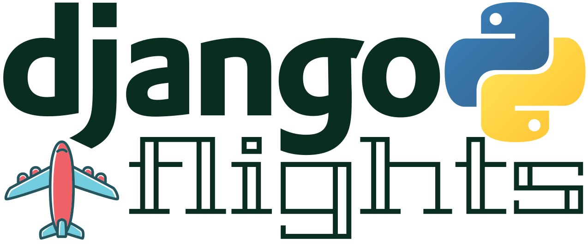

  

## Introduction
Django Flights is a full-stack web application built primarily using Python and Django where the user can add airports to their list and purchase (imaginary) tickets between two airports, automatically calculating ticket price based on how far the destination is from the origin.

## How to Use
Press Search on the navbar to search for an airport by its name or 3-digit IATA code. In order to access the app's full functionality, user has to signup and login. Once a user is logged in, they can add an airport to their list. Afterwards, the user can then purchase airplane tickets provided they have at least 2 different airports added to their list as origin and destination.

## Deployment Link

## Planning Materials
Trello (https://trello.com/b/yds2NpEE/django-flights)
Wireframe (Wireframe Here)
ERD (https://whimsical.com/A27qMm7GHX5VKM1WnVPpLk)

## Screenshots

## Technologies Used
- Python
- Django
- HTML5
- CSS
- Javascript
- PostgreSQL

## Additional Resources
Flatpickr
OpenWeatherAPI
Air pollution icons: https://www.wunderground.com/
Plane image: https://www.vectorstock.com/royalty-free-vector/plane-top-view-vector-10020407
Checkout image: https://geoparkinillustration.files.wordpress.com/2020/05/airportcheck-inqueue.jpg
Airport Lounge Background: https://www.vecteezy.com/vector-art/1637736-airport-lounge-background
Custom JSON API (https://raw.githubusercontent.com/jbrooksuk/JSON-Airports/master/airports.json)

## Disclaimer
This project is not officially endorsed by Django Software Foundation and/or by the Django Core team. See the <a href='https://www.djangoproject.com/trademarks/'>Django Trademark License Agreement</a> for usage of Django name on this project.